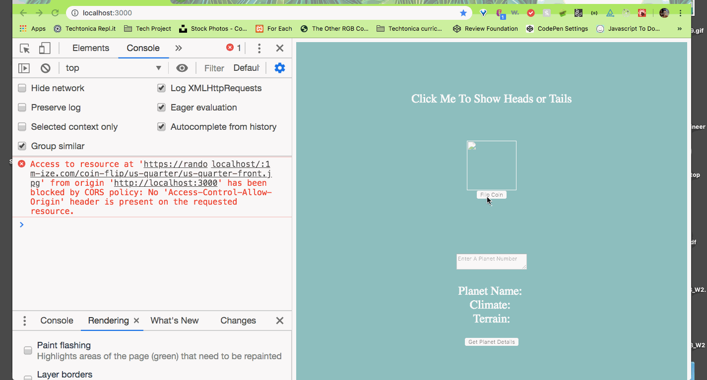

---------------

This project was bootstrapped with [Create React App](https://github.com/facebook/create-react-app).

## HTML, REACT

In the project directory, my objective was to create an app that was able to render a button that allows the user to toggle between the word heads and tails.

### Thought Process
1. Create a clickable button.
2. Output => toggle a displayed word head or tail (each with 50% probability)
3. Create a start display state with null / nothing    
4. Handle a click event that changes display (true => image toggle) state when click is on    
5. Do not change display (false => stays as last state) with not clicked    
6. Create a function that goes inside click event that handles toggle between heads and tails 
7. Button does not disable

### Progression

Was able to load results to console, not to page. 

Attempted use of `document.getElementById` to force text rendering to page. Toggle successful.

